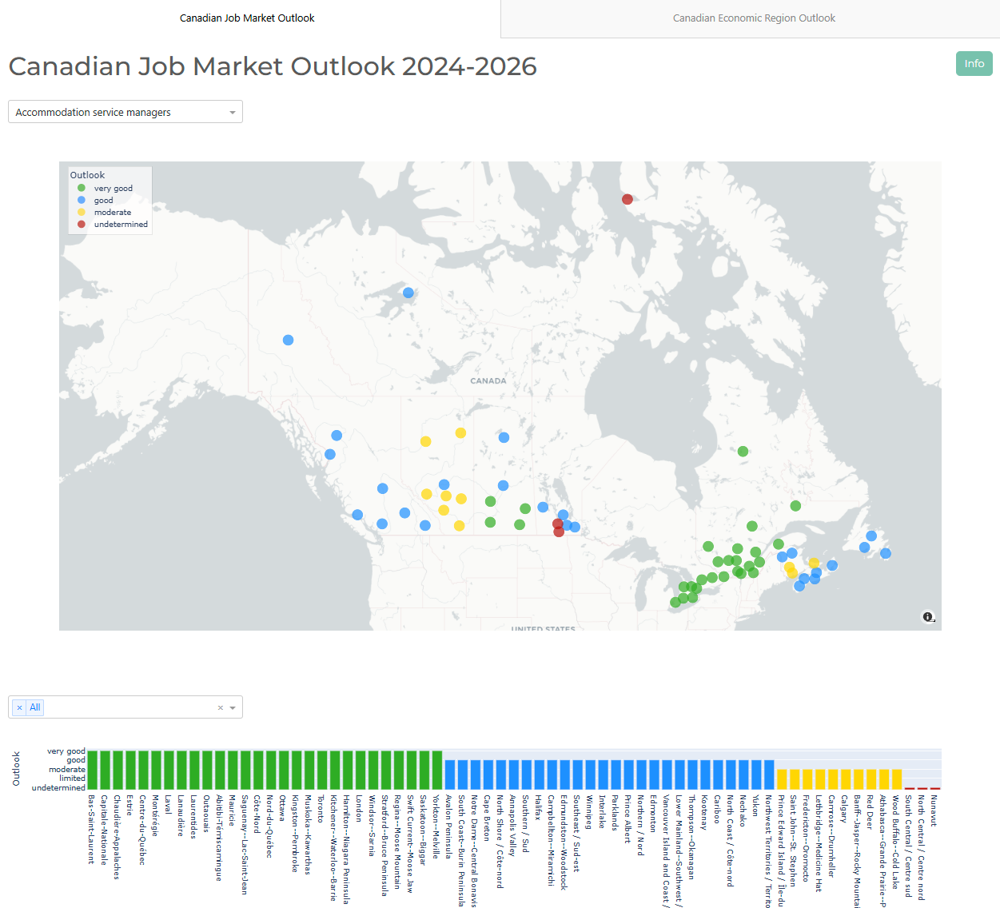
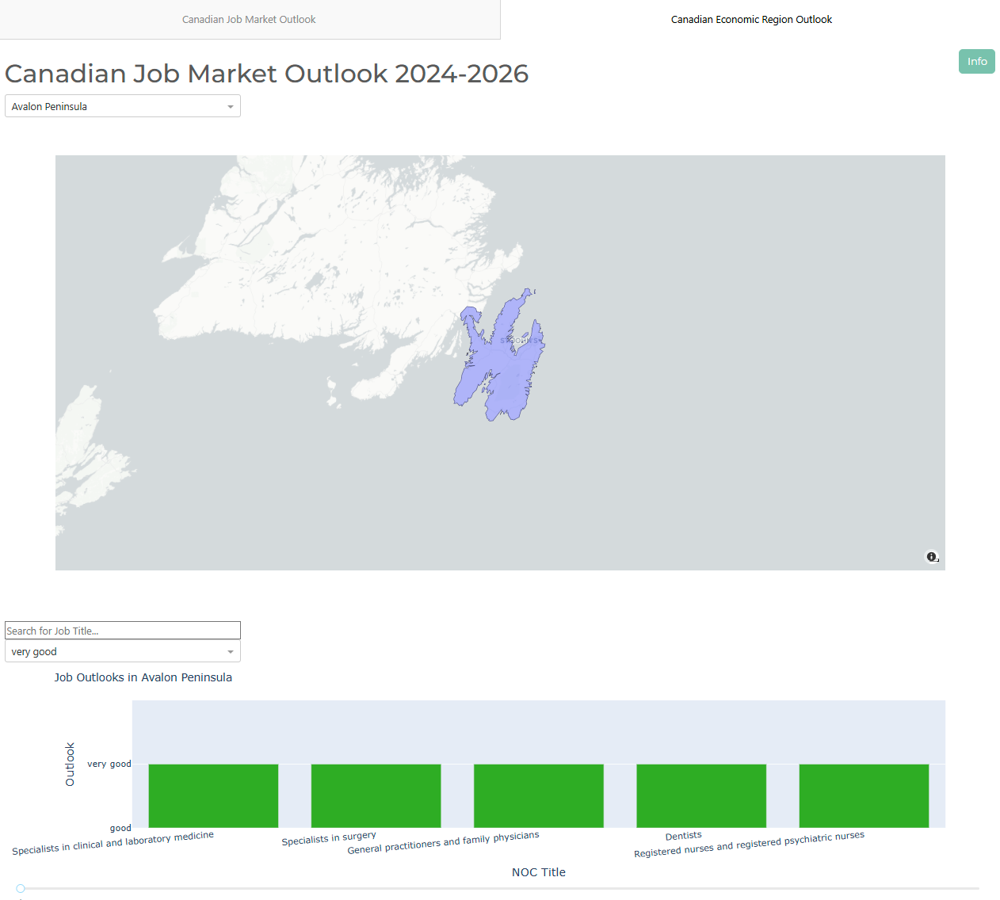

# Economic Region Outlook Data App

This app is probably the most "unemployed" thing I've ever done. It was inspired by my struggle to find work and my search for promising career paths. During my search, I came across [this job bank website](https://www.jobbank.gc.ca/outlookreport/location/), which provides data on job prospects for a specified region. While the site does its job, it only offers a `.xlsx` file containing all the jobs for that region, sorted by their NOC ([National Occupation Classification](https://www.canada.ca/en/immigration-refugees-citizenship/services/immigrate-canada/find-national-occupation-code.html)). However, this classification isn't particularly helpful for someone simply trying to identify the best job opportunities in their area. As far as I could tell, there was no way to sort the table directly on the website.

The app started as a simple solution to help me find the best job outlooks in a given region. I created [JobOutlookApp.py](src/JobOutlookApp.py), a more efficient app that uses a dropdown menu to sort jobs by region. The table is automatically sorted from best to worst outlook, and there's also a search bar in the top left for finding specific jobs. While the app was already a big improvement, I wanted something even more visual.

My next idea was to visualize career outlooks on a map. I envisioned an interactive map with color-coded markers representing job prospects for a given career across different economic regions in Canada. Another version of the app would display the boundaries of a selected economic region and show all job outlooks within that region. This approach would make it easier to understand career prospects at a glance and explore job opportunities in specific areas.

This is a Dash web application that displays economic region outlook data for Canada. The app allows you to select a language (English or French), choose a specific city or economic region, and search for specific NOC Titles (job titles). It includes detailed views of employment trends for the selected NOC Title and economic region. The app combines two dashboards: one for viewing job market outlook by NOC Title and another for viewing economic region outlook.


 

## Features
- Select language (English or French)
- Choose an economic region from a dropdown menu
- Search for specific NOC Titles
- View detailed employment trends for the selected NOC Title
- View economic region outlook data
- Switch between two dashboards using buttons
- Visualize career outlooks on an interactive map with color-coded markers
- Display boundaries of selected economic regions with job outlooks
- Data sourced and provided by the Government of Canada

## Installation

1. Clone the repository:

```bash
git clone https://github.com/yourusername/economic-region-outlook-app.git
cd economic-region-outlook-app
```

2. Create a virtual environment and activate it:

```bash
python -m venv venv
source venv/bin/activate  # On Windows, use `venv\Scripts\activate`
```

3. Install the required packages:
```bash
pip install -r requirements.txt
```

## Usage
```bash
python src/JobOutlookApp.py
```

## Data
The data used in this app is sourced and provided by the Government of Canada. You can visit their website for more information:

Government of Canada - National Occupational Classification (NOC) - https://www.statcan.gc.ca/en/subjects/standard/noc/2021/indexV1

## Screenshots

## Contributing
If you would like to contribute to this project, please open an issue or submit a pull request.
